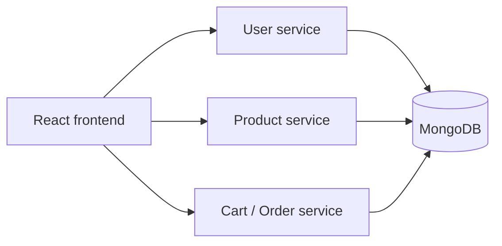

# E-commerce Microservices Application

A containerized e-commerce application that separates **user management, product management, and cart/order workflows into independent backend services**, with a React frontend and Kubernetes deployment configuration.

The project was built to explore service decomposition, API-driven communication, containerization, and CI/CD around a small distributed application.

## Architecture



Each backend service is independently containerized and can be deployed through the included Kubernetes manifest.

## Services

| Directory | Responsibility |
| --- | --- |
| `frontend/` | React e-commerce interface |
| `uc1/` | User management service |
| `uc2/` | Product management service |
| `uc3/` | Cart and order management service |

The backend services use **Node.js, Express, Mongoose, and MongoDB**, with CORS and environment-based configuration.

## Infrastructure

- **Docker** — each backend service includes its own Dockerfile
- **Kubernetes** — `kubernetes.yaml` defines the application deployment
- **Jenkins** — the included `Jenkinsfile` captures the CI/CD workflow used for the project
- **Environment configuration** — database connection strings are supplied through local `.env` files and are intentionally excluded from source control

## Local configuration

Create a local `.env` file inside each backend service directory from the provided template:

```bash
cp uc1/.env.example uc1/.env
cp uc2/.env.example uc2/.env
cp uc3/.env.example uc3/.env
```

Then replace the placeholder MongoDB values with your own development database connection string.

> Do not commit local `.env` files or production credentials.

## Containerized deployment

Build the backend service images from the Dockerfiles in `uc1`, `uc2`, and `uc3`, then deploy the services using:

```bash
kubectl apply -f kubernetes.yaml
```

The exact image names and cluster configuration may need to be adjusted for your environment.

## Tech stack

**React · JavaScript · Node.js · Express · MongoDB · Mongoose · Docker · Kubernetes · Jenkins**

## What this project demonstrates

- Decomposing a web application into domain-focused services
- Running services independently in containers
- Externalizing database configuration from application code
- Deploying multiple services through Kubernetes
- Structuring a basic CI/CD workflow with Jenkins

## Scope

This is an educational distributed-systems project rather than a production commerce platform. It focuses on architecture, service separation, and deployment mechanics rather than production concerns such as service meshes, distributed tracing, autoscaling, or hardened secret management.
